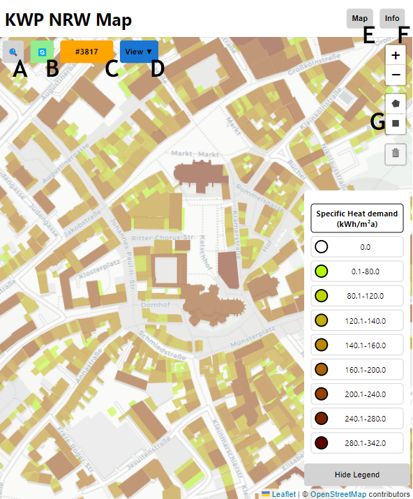
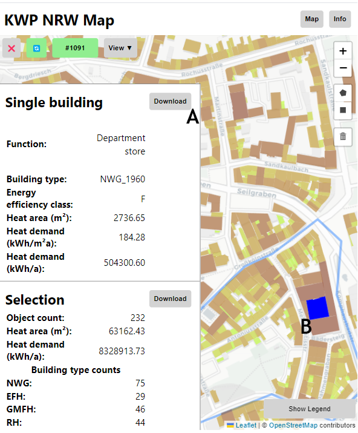

# OpenNRW Heat Demand Map
This is an application for visualizing heat demand in NRW, according to the model from the [OpenNRW project](https://www.opengeodata.nrw.de/produkte/umwelt_klima/klima/kwp/).
You can view various attributes as a map overlay and export the data as a JSON file for further analysis using map interactions.
An online version of this application can be found [here](https://ipkw.nowum.fh-aachen.de).

## Technology
The Map is built using the [React](https://reactjs.org/) library and the [Leaflet](https://leafletjs.com/) library for the map.
It uses the [OpenStreetMap mbtiles](https://osmlab.github.io/osm-qa-tiles/country.html) for germany and uses the [Cartodb Light Style](https://github.com/CartoDB/basemap-styles)

## Setup

Node.js and npm are required to run this application. You can download them from the [official website](https://nodejs.org/en/).
This application can be run locally by using the react local url from the environment file, or by default using the opendata server of the NOWUM-Institute.
If running locally, the nrw_kwp_waermedichte crawler must have been run and the stored function in kwp_bbox_function.sql or this script must have been executed in the database.
```sql
DROP FUNCTION kwp_nrw_by_bbox;

DROP TYPE IF EXISTS kpw_nrw_map_info;

CREATE TYPE kpw_nrw_map_info AS (
    Fest_ID bigint,
    Gemeinde text,
    Strasse text,
    HAUSNR double precision,
    Nutzung text,
    GEBAEUDETYP text,
    Nutzflaeche double precision,
    RW_WW_spez double precision,
    RW_WW double precision,
	geometry text
);
CREATE OR REPLACE FUNCTION public.kwp_nrw_by_bbox(
    in_xmin DOUBLE PRECISION,
    in_ymin DOUBLE PRECISION,
    in_xmax DOUBLE PRECISION,
    in_ymax DOUBLE PRECISION
)
RETURNS SETOF kpw_nrw_map_info AS $$
BEGIN
    RETURN QUERY SELECT 
        "Fest_ID",        
        "Gemeinde",
        "Strasse",
        "HAUSNR",
        "Nutzung",
        "GEBAEUDETYP",
        "Nutzflaeche",
        "RW_WW_spez",
        "RW_WW",
        ST_AsText(ST_Transform(geometry, 4326)) AS geometry
    FROM nrw_kwp_waermedichte.waermedichte
    WHERE ST_Contains(
        ST_Transform(
            ST_MakeEnvelope(in_xmin, in_ymin, in_xmax, in_ymax, 4326),
            25832
        ),
        ST_Transform(geometry, 25832)
    )
    AND "Nutzflaeche" > 10   
    LIMIT 40000;
END;
$$ LANGUAGE plpgsql STABLE;
NOTIFY pgrst, 'reload config';
NOTIFY pgrst, 'reload schema';
```

Navigate to the folder of this file in the terminal and run the following commands:

```bash
npm install
npm start
```

## Usage
### Initial View


- A: Hide or show the data view and export menu.
- B: Reload data in the current map view.
- C: The amount of loaded buildings, red color indicates a likely performance loss.
- D: The legend selector, choose the attribute to display.
- E: Access this view.
- F: Access the info view.
- F: Draw a polygon or square to filter the data for export.

### Data export


- A: Export the data in the current view as a JSON file.
- B: The currently selected building is marked in blue.