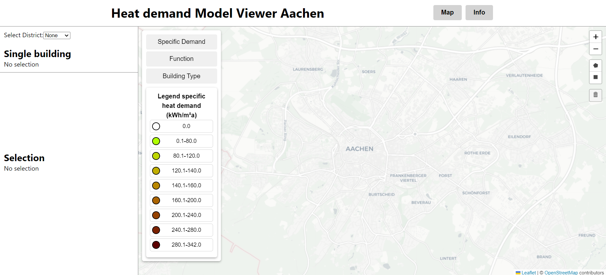
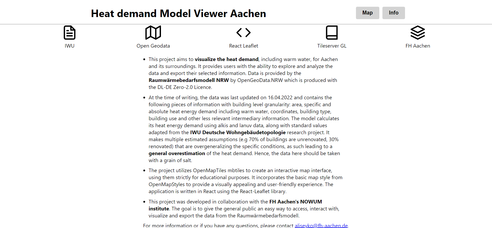
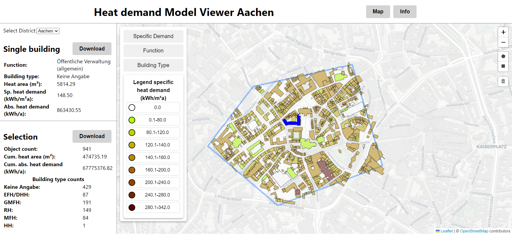
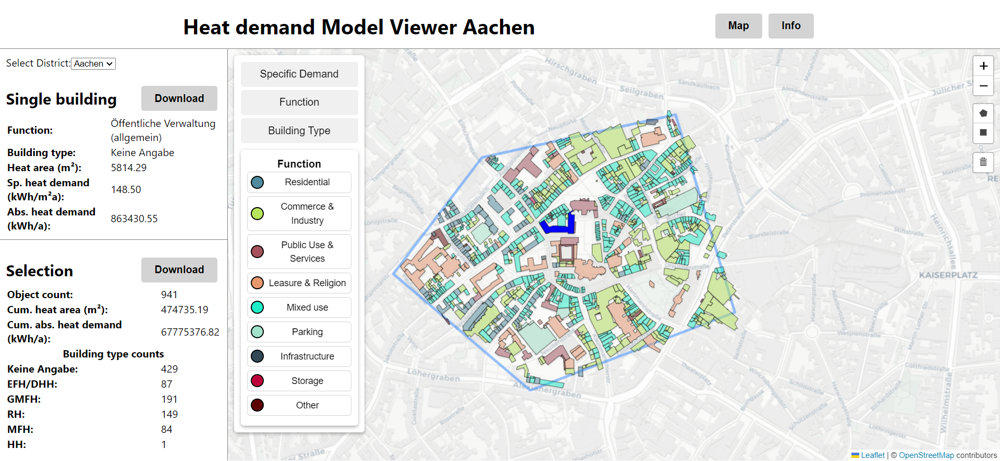

# Project Documentation VA

## User Manual
This is a end user manual for the project. It explains the capabilities of the application and how to interact with it.
The goal of this project is to let interested people explore the Raumwärmebedarfsmodell provided by https://www.opengeodata.nrw.de/produkte/. The end product is a web application centered around a OpenStreetMap Map with which the user can Interact with to extract information visually or via file download. The webapp is not suitable for mobile use and should be used with a Computer.

### Features
**Upon launching the app, the inital view is as follows:**

Here you can see the baseline view without any interaction. Relevant features are:

1. The Top Ribbon Tab selector allows swapping between the Map view and the Info view.
2. The "Select District" button lets the user choose and load an area from NRW to be inspected.
2. The draw buttons allow the user to select an area to inspect its heat energy related information.
3. The delete button allows the user to clear their selection and start over.

The Map is using the [OpenStreetMap mbtiles](https://osmlab.github.io/osm-qa-tiles/country.html) for germany and uses the [Cartodb Light Style](https://github.com/CartoDB/basemap-styles).  

**When the Info tab is selected, the following is shown:**

In the Info tab the user can see:

1. A selection of Icons with links attached to them, bringing them to related sources.
2. The developers contact details in case of further questions.

**Once a selection has been drawn, the Map tab is updated:**

After selecting a region and loading a district, the following options are available in the Map Tab:

1. A specific building can be selected by clicking on it, which marks it blue.
2. Complete data about the whole selection or single buildings can be downloaded using the drawer on the side.
3. Different view modes allow the user to see building usage and building type.

## Developer Manual

This is a developer manual for the project. It explains how to set up the project and how to further develop it as well as general advice.

### Setup
- Node.js and npm are required to run this project. You can download them here: https://nodejs.org/en/download/

- Docker is required to run the backend. You can download it here: https://www.docker.com/products/docker-desktop

- The two provided .env files are for self hosting the whole of NRW and for remote hosting only Aachen respectively and can be used in combination with Docker for specific Versions of the app.

- If you want to locally host your own MapTiles (70GB), you must download them in an OSM compatible format (normally from https://data.maptiler.com/downloads/tileset/osm/) using mbtiles from another source may not work correctly as the style is not compatible.

- If you do not care about locally hosting your own mbtiles, replce line 15 in style.json in BE with: "url": "https://api.maptiler.com/tiles/v3/tiles.json?key=vxwTteV2ISa300t06Nct" or any other maptile server.

#### Run frontend
Open FE folder in terminal then run:

1. npm install
2. npm start

#### Run backend
Open BE folder in terminal then run:

1. docker run -it -v ${pwd}:/data -p 8080:8080  maptiler/tileserver-gl 

### Development
The Project is split into a backend for hosting tiles and frontend for the actual react app. Most changes should be done in the FE folder unless a different tile source is required.

#### Backend
- World mbtiles should be placed in /tiles 
- Styles should be placed in /styles 
- Changes to styles or mbtiles or other backend configurations **MUST** be reflected in config.json and style.json.

#### Frontend
- If a different Raumwärmemodell source shapefile is required, change the url in the fetch request in RaumwaermeExplorer.js from AachenShape.zip to the desired shapefile.
- The new Raumwärmemodell should be place in the "public" folder of the react app.
- To edit the Map App, edit MapComponent.js
- To edit the overall layout, consider modifying Layout.js or RaumwaermeExplorer.js. 
- HTML should when possible be kept in the ui folder.

#### Do's and Don'ts
- Do change the layout or ui of the frontend as you see fit.
- Do try out a different shapefile for different results, maybe even a different use case such as weather data.
- Do play around with the rendering options for the legend and the features to adjust them to something appropriate to your use case.
- Do get in contact with the original dev if you have any problems or questions.
- Don't play with the mbtiles or mapstyles unless you know what you are doing.
- Don't try to render all features from a shapefile at once, it will likely cause the app to be unbearably slow. 
- Don't add many additional react components to Top level components, it will likely cause the app to be unbearably slow as map apps are very resource intensive.