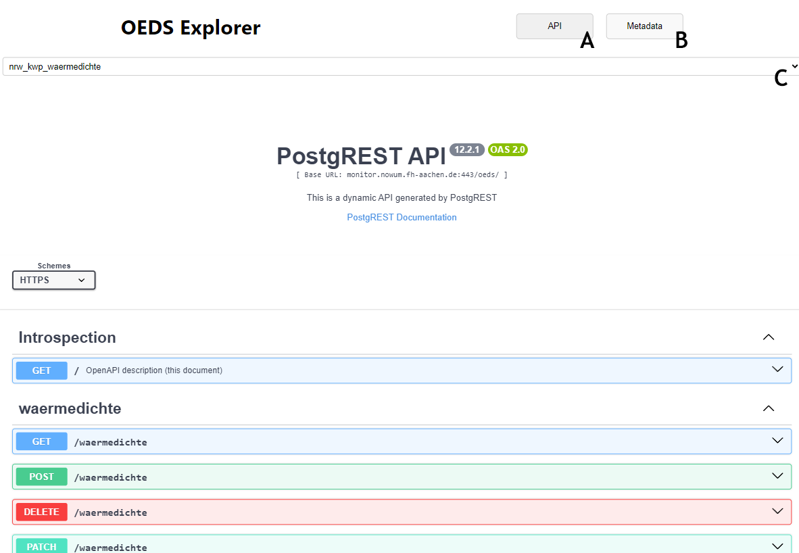
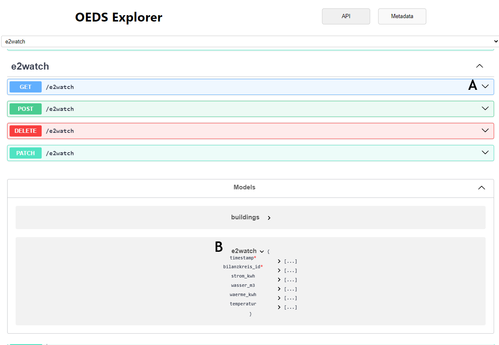

# OpenNRW Heat Demand Map
This is an application for viewing the metadata schema of the OEDS, as well as the OpenAPI [OpenAPI](https://www.openapis.org/) REST API description automatically generated by [PostgREST](https://postgrest.org/en/v12/index.html).
To visualise this data, there is a [Swagger](https://swagger.io/tools/swagger-ui/) ui interface as well as a map and timeline viewer for the data.

## Technology
The Map is built using the [React](https://reactjs.org/) library, the [Leaflet](https://leafletjs.com/) library for the map and the [Recharts](https://recharts.org/en-US/) library for the timeline.
It uses the [OpenStreetMap mbtiles](https://osmlab.github.io/osm-qa-tiles/country.html) for germany and uses the [Cartodb Light Style](https://github.com/CartoDB/basemap-styles)

## Setup

Node.js and npm are required to run this application. You can download them from the [official website](https://nodejs.org/en/).
This application can be run locally by using the react local url from the environment file, or by default using the opendata server of the NOWUM-Institute.
If running locally, the metadata must have been filled in the database.

Navigate to the folder of this file in the terminal and run the following commands:

```bash
npm install
npm start
```

The OpenAPI schema can be udate by using the following sql statement:
```sql
NOTIFY pgrst, 'reload config';
NOTIFY pgrst, 'reload schema';
```

## Usage
### Initial View


- A: Show the OpenAPI REST model.
- B: Show the Metadata Overview.
- C: Select the OpenAPI REST display schema.

### OpenAPI REST Model


- A: Open and close a endpoint description.
- B: Inspect the database model.

### OpenAPI REST Example Request


- A: The command to execute a test request.
- B: The full details of the sent request.
- C: The response of the demo request as a json.

### Metadata Overview


- A: Filter the metadata cards and select them.
- B: Overlapping minimal concave hulls of all metadata.
- C: Overlapping min and max date span of all metadata.

### Metadata Selection


- A: Spatial data with zoom to extent.
- B: Filtered spatial data.
- C: Filtered temporal data.
